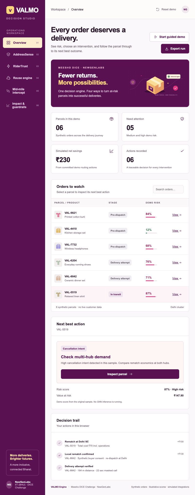

# VALMO Decision Studio

### Fewer returns. More possibilities.

**NewGenLabs · IIT (BHU) · Meesho DICE Challenge, Stage 2**

[Open the live prototype](https://raghav-bansal-15.github.io/valmo-prototype/) · [Download the offline demo](https://raw.githubusercontent.com/Raghav-Bansal-15/valmo-prototype/main/dist/valmo-demo.html)

VALMO Decision Studio is an interactive operations prototype for reducing return-to-origin, or RTO, shipments. It brings buyer confirmation, delivery-attempt verification, local parcel reuse, and in-transit interception into one workspace. Each decision follows a parcel and records its outcome and simulated cost.



## The problem

A failed delivery can send a parcel back to its seller even when the original buyer could accept a new slot or a compatible buyer is nearby. Cancellation intent can also emerge while the parcel is still travelling. Operations need to know which orders need attention, whether a delivery attempt was genuine, and which recovery route is feasible before paying for the return journey.

## How the prototype works

| Module | Decision demonstrated |
| --- | --- |
| Overview | Find an at-risk parcel, inspect its next action, and follow the decision trail. |
| AddressSense | Inspect a sample risk score, check hub serviceability, and simulate buyer confirmation or address correction. Silence alone does not hold dispatch. |
| RiderTrust | Accept attempt evidence only when the rider is within 500 m of the address and the masked call lasts longer than 15 seconds. |
| RTOShield / Reuse engine | Match an eligible refusal at the destination hub to nearby demand, obtain buyer consent, re-dispatch, and record the delivery outcome. |
| DispatchSmart / Mid-mile intercept | Compare compatible demand at Delhi and Jaipur with partial reverse logistics, then choose the cheapest feasible route. |
| Impact & guardrails | Inspect scenario economics, change planning assumptions, and export the action trail as JSON. |

Reuse requires a verified genuine refusal, hub intake, refusal marking within 24 hours, seller permission, compatible demand, a hold of at most seven days, and reuse inventory within 15% of hub capacity. Quality and hygiene exclusions take priority. An unavailable customer gets rescheduling; an address failure gets landmark recovery. A variant difference requires explicit buyer consent.

## Try the demo

Open the [hosted prototype](https://raghav-bansal-15.github.io/valmo-prototype/) and select **Start guided demo**. No login or download is required.

1. In AddressSense, preview and queue the nudge for **VAL-9821**, then confirm delivery on the phone preview.
2. In RiderTrust, select **Load genuine attempt** and **Verify attempt** for **VAL-8842**.
3. In Reuse, send a rematch offer, simulate buyer acceptance, re-dispatch locally, and simulate successful delivery. Savings enter the run after that outcome.
4. In Mid-mile intercept, inspect **VAL-5519**. Switch Delhi demand off to see the Jaipur route, then commit a simulated route.
5. In Impact, inspect the recorded actions and export the run.

Use **Next demo step** to move through the walkthrough. **Reset demo** restores the starting state. Every visitor sees the same prototype version; each browser saves its own run locally.

## Scenario economics

The interception example uses a ₹170 traditional RTO baseline. Each route includes ₹10 in operating costs.

| Feasible route | Total scenario cost | Saving against baseline |
| --- | ---: | ---: |
| Delhi rematch | ₹70 | ₹100 |
| Jaipur rematch | ₹83 | ₹87 |
| Partial reverse from Delhi | ₹129 | ₹41 |

The default planning mix is 20% Delhi rematch, 25% Jaipur rematch, and 55% partial reverse. Its weighted saving is **₹64.30 per intercepted parcel**. These figures are proposal assumptions used by the demo, not measured pilot results.

## Implementation status

The frontend implements the interactive workflows, policy checks, parcel-specific state, buyer-consent sequence, route calculations, guided demo, and JSON export. Completed actions cannot count savings twice.

Orders, buyer identities, risk scores, demand, telemetry, messages, and delivery outcomes are synthetic. The prototype sends no real messages and has no live logistics or model-inference integration.

`model-source/` contains seven supplied Python scripts for data preparation, tabular baselines, graph construction, GraphSAGE training, and evaluation. Datasets, graph artifacts, and a trained checkpoint are not included. The scripts have not been run as part of this frontend release. GraphSAGE is the supplied baseline; live DPHGNN inference remains outside this prototype.

## Run locally

Use a current Node.js release. The frontend has no npm package dependencies, so installation is not required.

```sh
git clone https://github.com/Raghav-Bansal-15/valmo-prototype.git
cd valmo-prototype
npm start
```

Open [localhost:4187](http://localhost:4187).

```sh
npm test       # Run the policy and workflow tests
npm run build  # Generate the self-contained offline demo
```

For offline use, download and open `dist/valmo-demo.html` in a browser. The source `index.html` uses JavaScript modules and should run through the local server. GitHub Pages serves the hosted app from `main` at the repository root.

## Repository guide

| Path | Contents |
| --- | --- |
| `app/engine.js` | Policy rules, compatibility checks, reuse transitions, and cost calculations |
| `app/` | Screen rendering, browser state, styles, and illustrations |
| `tests/engine.test.mjs` | 13 automated policy and workflow tests |
| `model-source/` | Supplied Python modelling pipeline |
| `dist/valmo-demo.html` | Single-file offline build |
| `design/` | Design tokens, process notes, reference board, and screenshots |
| [SUBMISSION.md](SUBMISSION.md) | Presentation and handoff guide |

The interface follows the submitted deck's plum, pink, warm yellow, and blush palette. The [Paper design file](https://app.paper.design/file/01M45N62H1HM7FX426JC4XPR56/p-1-0) contains the foundations, overview, and a partial AddressSense artboard. All six screens are implemented in the frontend. See the [design process](design/PROCESS.md) and [screen board](https://raghav-bansal-15.github.io/valmo-prototype/design/board.html) for the design sequence.

## Validation

The release passed 13 automated tests covering attempt-verification boundaries, reuse eligibility, buyer compatibility and consent, workflow transitions, routing costs, weighted savings, and duplicate-action protection. Browser checks covered the hosted guided journey, reuse exception states, saved state, and mobile layouts. The hosted journey completed without browser console errors.
